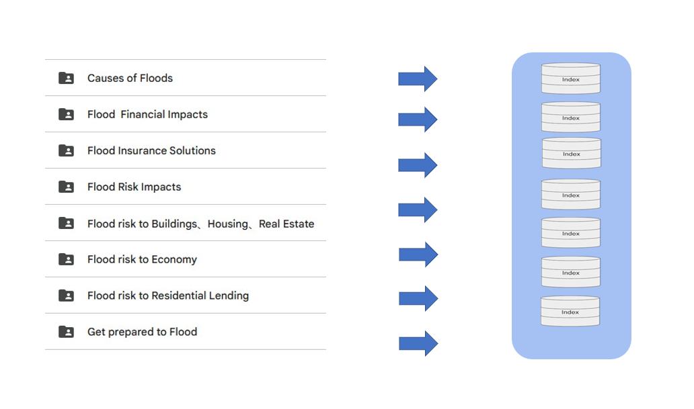

# Data Processing Method

### Description
Our data collection methodology emphasizes the identification of content with distinct themes, focusing on organizing key points and relevant information within each theme. This structured approach ensures both the accuracy and clarity of the data, facilitating seamless presentation and in-depth analysis.

To enhance the AI system's ability to accurately interpret queries and retrieve relevant data, we have categorized the information into eight distinct types based on its attributes. This classification ensures efficient and precise data matching for improved outcomes.

